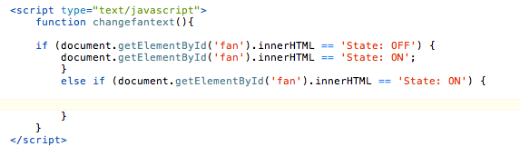
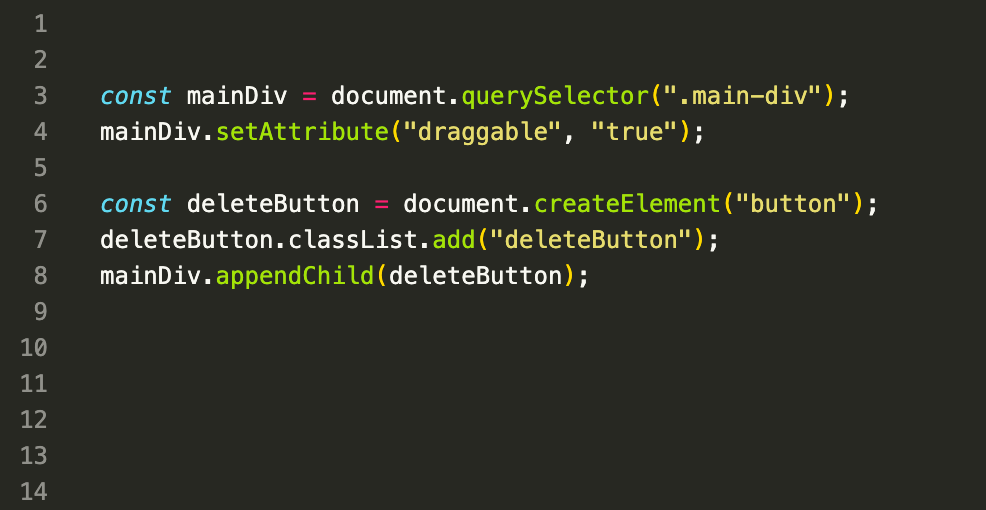

# What is DOM JavaScript ?
>  DOM JavaScript интерфейси барномасозии аз платформа ва забон мустақил буда, ба барномаҳо ва скриптҳо имкон медиҳад, ки ба мундариҷаи ҳуҷҷатҳои HTML, XHTML ва XML дастрасӣ пайдо кунанд ва мундариҷа, сохтор ва намуди зоҳирии чунин ҳуҷҷатҳоро тағир диҳанд. DOM ба сохтори ҳуҷҷат маҳдудият ҷорӣ намекунад.

### EXAMPLE

    

> Мувофиқи модели объекти ҳуҷҷат (кӯтоҳ DOM), ҳар як теги HTML объект аст.
Зертегҳо "фарзандони" унсури волидайн мебошанд. Матне, ки дар дохили тег аст, инчунин як
объект.Ҳамаи ин объектҳо бо JavaScript дастрасанд, мо метавонем онҳоро барои тағир додани саҳифа истифода барем.
JavaScript метавонад ҳамаи унсурҳои HTML-ро дар саҳифа тағир диҳад.
JavaScript метавонад ҳамаи атрибутҳои HTML-ро дар саҳифа тағир диҳад.
JavaScript метавонад ҳамаи услубҳои CSS-ро дар саҳифа тағир диҳад.
JavaScript метавонад унсурҳо ва атрибутҳои мавҷудаи HTML-ро нест кунад.
JavaScript метавонад унсурҳо ва атрибутҳои нави HTML илова кунад.
JavaScript метавонад ба ҳама рӯйдодҳои мавҷудаи HTML дар саҳифа ҷавоб диҳад.
JavaScript метавонад рӯйдодҳои нави HTML-ро дар саҳифа оташ диҳад
Таъриф ва истифода. Усули querySelector() унсури аввалини кӯдакро, ки ба a мувофиқ аст, бармегардонад
Интихобкунандаи муайяншудаи CSS-и элемент, усули querySelectorAll() метавонад барои дастрасӣ ба ҳама унсурҳо истифода шавад
ки бо интихобкунандаи муайяни CSS мувофиқат мекунад.

# innerHTML

> innerHTML - Ин амвол роҳи осонро барои пурра таъмин мекунад
мундариҷаи элементро иваз кунед. Масалан, ҳама мундариҷа
унсури бадан метавонад хориҷ карда шавад

# HTML Events

> Ҳодисаҳои HTML "чизҳое" мебошанд, ки бо унсурҳои HTML рӯй медиҳанд. Вақте ки JavaScript дар саҳифаҳои HTML истифода мешавад, JavaScript метавонад ба ин рӯйдодҳо "вокуниш" кунад.

# createElement() 

> Усули createElement() дар JavaScript барои сохтани як унсури нави HTML бо номи тег истифода мешавад

# appendChild()

> Усули appendChild()-и интерфейси Node гиреҳро ба охири рӯйхати кӯдакони гиреҳи волидайнии муайяншуда илова мекунад.
.png)

# append()

> усули append() маҷмӯи объектҳои Node ё объектҳои сатрро пас аз фарзанди охирини ҳуҷҷат дохил мекунад.

.png)

